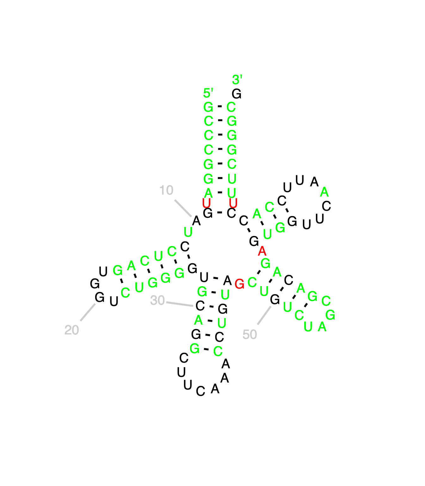
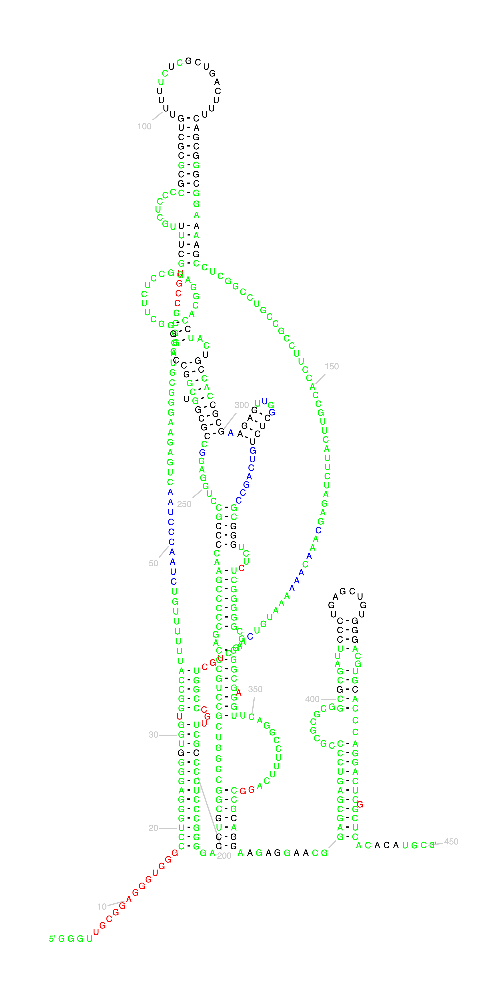
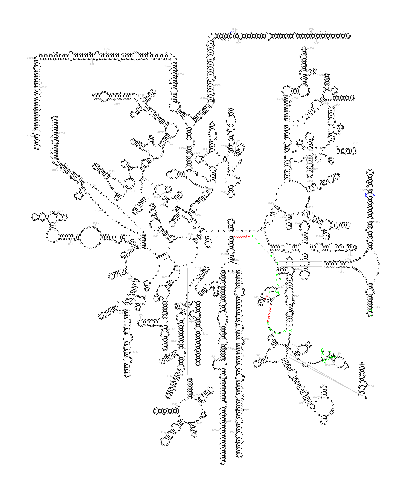

# RNA-LZW: A Novel Method for Detection of Stems and Pseudoknotted Structures in Non-Coding RNA

## Abstract
In this paper, we propose RNA-LZW, a novel algorithm for RNA secondary structure prediction. Unlike existing bioinformatics tools, we do not utilize minimum free energy calculations. This allows us to overcome the NP-complete nature of detecting pseudoknots, and the difficulty of detecting long range interactions. To do this we have modified the Lempel-Ziv-Welch compression algorithm, which  uses a dictionary-based approach to find patterns within a string of characters. We hypothesize that RNA-LZW could adapt this compression algorithm for the purposes of finding potential stems and pseudoknots in given RNA sequences, regardless of base pair distance between matches. 

RNA-LZW was tested against canonical structures sourced from the RNACentral database. Preliminary results show that statistically significant similarities can be seen between some known structures and those generated by RNA-LZW, however further development is needed in order to realize RNA-LZW's full potential. Though it has several immediate restrictions, it represents a step towards being able to predict pseudoknotted structures and long distance stems efficiently, especially in large RNA sequences. As there are currently no other algorithms that achieve this goal, we believe that this is important enough to warrant future attention. 

## Introduction
Detecting RNA secondary structures is a process which is integral to understanding the functions of non-coding RNA sequences. Though there are existing bioinformatics tools used for detection, these programs are not without their limitations. 

Specifically, RNAz uses a sliding window approach in its analysis of a sequence \[1\]\[2\], meaning there may be structures with loops existing outside the scope of the window.

Additionally, it has been proven that utilizing current mimimum free energy calculations for the purposes of predicting pseudoknotted structures is an NP-Complete problem [3].

In order to overcome both these hurdles, we utilize the Lempel-Ziv-Welch (LZW) algorithm, which is a universal lossless compression algorithm used for a variety of applications such as Unix file compression. The algorithm compresses data by using a dictionary to assign common sequences of characters to a fixed-length code (typically 12-bit) [4].

Because RNA structure exists in a 3-dimensional capacity, with its final form assuming a tertiary structure, base pairings which may appear to be distant from one another in a secondary structure can in reality exist very closely to one another once their tertiary structure is assumed. Given the LZW algorithm’s dictionary approach to pattern-matching,  RNA-LZW can detect the presence of distant pseudoknots in a structure in much the same way that it detects regular base pairing. 

We propose that RNA-LZW could serve as a pre-processing step to determine if there are notable base pairings throughout a given sequence, which may not be accounted for by standard secondary structure detection methods.

## Algorithms

### Lempel-Ziv-Welch Encoding

RNA-LZW uses only the encoding step of the LZW compression algorithm.  A high level overview of the encoding portion of the LZW algorithm as employed in RNA-LZW is shown below:

1. Initialize the dictionary to contain all sequences of length one. 
	- In this case, the dictionary initially contains only four characters; A,U,C, and G. 
2. Initialize a buffer as the first character in the sequence.
2. Add characters from the sequence to the buffer until the buffer represents a sequence that is not already represented in the dictionary. 
3. At this point, the buffer, minus the last character, represents an entry in the dictionary. Its index is output.
4. The entire buffer is then added to the dictionary as a new sequence, with an incremented index.
5. The buffer is then reset to contain just the last character of the buffer.
6. repeat from step 3 until entire sequence is encoded.
	- Though not represented in a normal LZW algorithm, RNA-LZW records additional metadata about the position of the buffer in the greater sequence into the dictionary.
7. Though LZW encoding normally cannot iterate multiple times due to its need to be decoded without the dictionary; RNA-LZW acts with global information, and does not have that restriction, and therefore uses multiple iterations to build a more robust dictionary.

We modify the LZW algorithm in the following ways to make it more suited for the task of RNA folding:

- Instead of initializing the dictionary with all unicode characters, we use only A,U,C, and G.
- We disregard the output entirely, as we are not interested in encoding the sequence, only in building the dictionary of matching sequences.
- At each step of changing the buffer, the following steps are also followed:
	1. Check if the current buffer is above the minimum size, if so, continue.
	2. If the current index is not present in the dictionary entry for the current buffer key, add it.
	3. Check if the dictionary contains any entries for the matching base pair sequence, if so, add the current index to its dictionary entry.
- Finally, we are able to iterate over the given sequence multiple times. Since traditional LZW has the limitation of needing the output to be decoded by the recipient without the dictionary, this cannot be done normally. Since for the purposes of RNA-LZW we act with global information, we do not have that restriction, and therefore we can use 50 iterations over the given sequence to build a more robust dictionary.
- The final dictionary entries are keyed by the base sequence they correspond to. The values in the dictionary are two lists, locations where the key sequence is located, and possible pair locations where its matching sequences are located.

## Dot-Bracket Construction
Once we have the dictionary with many possible base matches, we must remove overlapping matches, and place only the most likely ones into the final output. Currently we measure stem likelihood first by length, and then by distance. The steps are as follows:
1. Remove impossible matches.
	- While adding entries to the dictionary, it is possible to add overlapping matches; where a sequence of bases can be paired with itself. For example, the sequence `UGAUAGCA` when reversed will exactly pair to itself. 
	
2. For each dictionary entry, parse the possible match locations and select the pair of base sequences that are the shortest distance apart.
3. Sort by match length.
4. Check the location of each stem placement in the output:
	1. If the location is empty, add the stem to the output, marked by a unique key at every base location along the stem.
	2. If any base in the location already has a stem, skip. Since we iterate from longest stems down to shortest, this biases the algorithm towards including longer stems.

At this point in the algorithm, the output consists of a unique symbol per stem (the symbol in the output is the index of the start of the right stem half), that is replicated at each base in the stem. To convert into standard dot-bracket notation, we must reduce the number of bracket symbols. For the purposes of notating pseudoknots, we use the bracket progression of `([{<ABCD` for opening brackets, and `dcba>}])` for closing braces.

This algorithm utilizes a single modified stack in order to match braces as it progresses through the output sequence. The stack is allowed to have "transparent" entries that stay on the stack, but peek and pop operations will return the first non-transparent entry on the stack. The algorithm operates as follows:
1. Iterate through the output, left to right.
	1. If the current value equals the top of the stack, pop the top of the stack. This is equivalent to finding a normal brace match.
	2. If the current value equals the index of the match, and that value is not on top of the stack, then we have found a closing bracket with its requisite opening bracket beyond the last opening bracket, meaning we have found a pseudoknot.
	- Since representing a pseudoknot requires a new style of brace, we iterate through the stack between the opening and closing brace (including transparent entries), seeking out the highest value of brace. We then assign a one higher value of brace to the current pair, and make both entries transparent. 
	3. item If neither of the above cases are true, we have a normal opening brace. Push current value to the stack.
2. Finally, we iterate through the output one more time, converting each unique id into its corresponding brace value, and replacing any gaps with the '.' character.

## Results

In order to test for RNA-LZW's efficacy in identifying potentially relevant stems and pseudoknots in a given structure, we compared our outputs against sequences where the secondary structure is known.  All sequences used were sourced from the RNACentral database. The dot-bracket notations of these known sequences were then compared to the dot-bracket output generated by RNA-LZW both visually and using a percent similarity string comparison. It should also be noted that RNA-LZW does not, in its current state, take wobble base pairing into account and is therefore incapable of finding the exact base pairings that occur in the known dot-bracket structures. 

### Homo sapiens tRNA-SeC (anticodon TCA) 1-1 (TRU-TCA1-1)

As seen in the above figure,  tRNAs are short sequences which serve as a good benchmark to visualize whether RNA-LZW is capable of outputting structures that are at all similar to those obtained by tried and true methods of RNA secondary structure discovery. 

Clearly, RNA-LZW cannot serve as a replacement for more accurate methods of secondary structure construction; however, the output shows that RNA-LZW is capable of producing somewhat similar structural features to a known dot-bracket structure.  In the case of this tRNA sequence,  RNA-LZW achieves 71% accuracy when doing a string comparison to the known dot-bracket structure.  This is promising result, especially given RNA-LZW's inability to account for wobble base pairing.

Due to the small size of this sequence, we can see that RNA-LZW's output is clearly different from the known structure, but the hypothesis that RNA-LZW is capable of matching base pairs from any range in the structure is supported by the output generated from this sequence. 

**GCCCGGAUGAUCCUCAGUGGUCUGGGGUGCAGGCUUCAAACCUGUAGCUGUCUAGCGACAGAGUGGUUCAAUUCCACCUUUCGGGCG**

RNA-LZW Output:

`(((((..(((...))).............((((....((())))...(((((....))))).((((.......)))).)))))))).`

Known Dot-Bracket Structure:

`(((((((.(..((((((....))))))((((((.......)))))).(((((....))))).((((.......))))).))))))).`

### Homo sapiens telomerase RNA

Telomerase is a ribonucleoprotein, meaning that it is a complex structure comprised of non-coding RNA and a protein binding to one another. Telomerase RNA contains a pseudoknot which is integral to telomerase's function [6]. The above figure helps visualize how these pseudoknots appear in nature.

The length of the sequence (450 nucleotides) makes the visual comparison shown in the below Table is difficult for the reader to assess. However, when doing a comparison of string similarity, RNA-LZW achieves 51% accuracy. Once again, assessment of this result must take into account RNA-LZW's inability to detect wobble base pairing. 

RNA-LZW Output

`(((((........(((((...(((((((.((((((.(((((((((..))))).....((((((.....(((((.......(((((((.((((((((...(((((.((((((...))))))....))))).....((((((.)))))................)))))))))))))))..((((.))))..((((((.)))))))....((((((((((..)))....)))))((((((((.(((((........((((((......))))))))))).......((((...))))))....((((....)))).....)))))).....)))))))).......)))).))))))..((((())))))).....))))))..(((((((..))))))))........)))))....((((..((()))))))))))))............` 

Known Dot-Bracket Structure

`.................((((((((((((((.(((((........................................(((((.......(((((((((................)))))))))..))))).......................................................)))))...))))))))))))))..(((((((......((((((((..(((((((..(((((........(((((.((((..(((...............)))...))))))))).((((....)))).......)))))....)))))))...))))).)))..............)))))))..........(((((((((((........(((((..((((........))))..)))))..))))))).))))........`

### Homo sapiens RNA, 28S ribosomal N1 (RNA28SN1)

Ribosomal ribonucleic acid is a primary component of ribosomes which carry out protein synthesis.  As can be seen in the above figure ,  this rRNA is a prime candidate for testing of larger sequences (5,066 nucleotides). 
In doing a string comparison, RNA-LZW only achieved 38% accuracy when analyzed against the known secondary structure.  This low accuracy seems more reasonable once we take into account the lack of wobble base pairing in RNA-LZW's dot bracket structure.  

## Discussion
Our algorithm shows a remarkable first step towards being able to detect pseudoknots in an efficient manner. Being able to build and parse a dictionary of matches that include pseudoknotted structures in linear time is valuable. It leaves resources free to improve the metrics by which we parse the dictionary to extract matches, while keeping the entire algorithm efficient. 

The first and most obvious place for improvement is in how we choose which dictionary entries make it into the final sequence. Currently we rank first by the length of the possible stem, and then by distance between the two sides. This is an entirely naive approach that still gave us a relatively high accuracy against well known structures. Replacing this ordering with a well developed free energy calculation would allow the algorithm to select more distant or shorter bonds that increase the stability of the final structure, and therefore predict structures that are more likely to be seen in nature.

A second issue is correcting for some artifacts of the LZW algorithm that appear at the start of a sequence. Since the algorithm starts at the first character of the sequence at each loop, and checks against the buffer, the dictionary will never contain a sequence longer than 2 that starts at the second index, 3 that starts at the 3rd index, and so on. This is a negligable constraint past the first ~50 bases, but could prevent RNA-LZW from finding good matches on small file sizes. To prevent this, an additional step of adding all permutations of the first ~50 bases to the dictionary would fully aleviate this issue. However, since this algorithm is primarily indented to work on large RNA sequences, this is a relatively minor improvement.

The most important next step for this algorithm would be to utilize its strengths of finding likely matches and pseudoknots across arbitrary distances in order to inform more traditional folding algorithms. By pipelining the output of RNA-LZW into these more developed algorithms, they can build likely pseudoknotted structures without having to overcome the NP-Complete barrier. This is an important step towards being able to efficiently predict the secondary structures of large non-coding RNA sequences. 

## Conclusion

While RNA-LZW has several immediate restrictions, it represents a step towards being able to predict pseudoknotted structures and long distance stems efficiently, especially in large RNA sequences. As there are currently no other algorithms that achieve this goal, we believe that this is important enough to warrant future attention. Our preliminary results show that, for a novel and prototype algorithm that does no free energy calculations, we are already able to predict a large number of structures. Since our algorithm is also completely agnostic to the presence of pseudoknots and long-distance structures, its value in reducing computation time for processing long RNA sequences is invaluable. 

[1] A. R. Gruber S. Findeiß, S. Washietl, I. L. Hofacker, and P. F. Stadler, “RNAZ 2.0: Improved Noncoding RNA Detection,” Pacific Symposium on Biocomputing, pp. 69–79, 2010. 

[2] S. Washietl, I. L. Hofacker, and P. F. Stadler, “Fast and Reliable Prediction of Noncoding RNAs,” Proceedings of the National Academy of Sciences, vol. 102 (7), pp. 2454–2459, 2005. 

[3] Lyngsø, Rune and Pedersen, Christian. (2000). RNA Pseudoknot Prediction in Energy-Based Models. Journal of computational biology : a journal of computational molecular cell biology. 7. 409-27. 10.1089/106652700750050862. 

[4] T. A. Welch, "A Technique for High-Performance Data Compression," in Computer, vol. 17, no. 6, pp. 8-19, June 1984, doi: 10.1109/MC.1984.1659158.

[5] I. L. Hofacker, S. Bonhoeffer, P. F. Stadler, R. Lorenz, and W. Fontana, “RNAfold manual page for RNAfold 2.4.16,” Theoretical Biochemistry Group. [Online]. Available:[https://www.tbi.univie.ac.at/RNA/RNAfold.1.html#heading7](https://www.tbi.univie.ac.at/RNA/RNAfold.1.html#heading7). [Accessed: 21-Feb-2021]. 

[6] D. Gilley and E. H. Blackburn, “The telomerase RNA pseudoknot is critical for the stable assembly of a catalytically active ribonucleoprotein,” Proceedings of the National Academy of Sciences, vol. 96, no. 12, pp. 6621–6625, 1999. 

